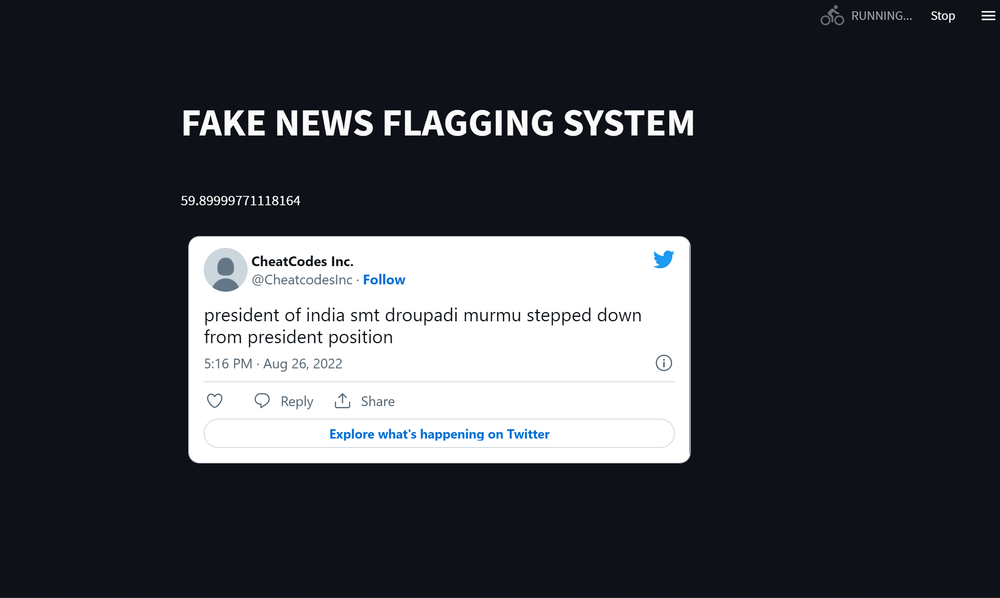
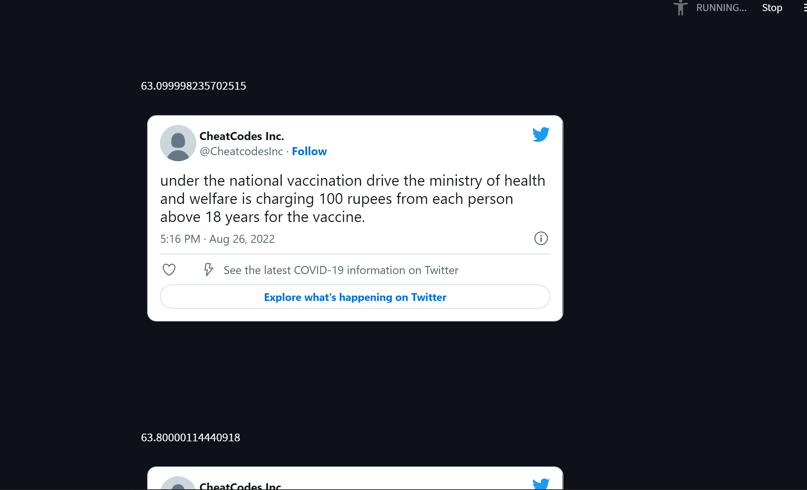

# Fake Tweet Flagger

Flags fake tweet from a specific twitter account.
The tweet which has been identified as fake will be displayed along with its meta data.

## How Fake Tweets are identified

Each tweet is compared against true news sourced from government handles.
And based on the cosine similarity of the tweet against the true news, it's flagged as true or fake.
## Execution

Run the streamlit app

```bash
  streamlit run app.py
```
    
## Screenshots






